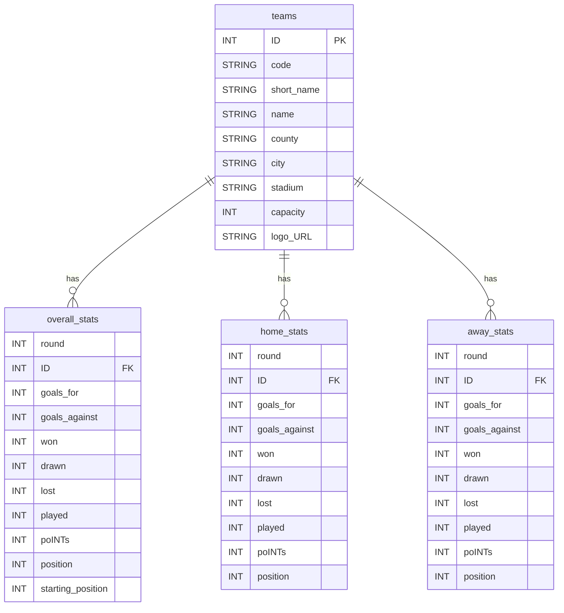

# premier-league-table
2025/26 Premier League Table

## 설치

```shell
c:\GitHub\premier-league-table\.venv\Scripts\python.exe -m pip install requests
c:\GitHub\premier-league-table\.venv\Scripts\python.exe -m pip install pandas
c:\GitHub\premier-league-table\.venv\Scripts\python.exe -m pip install rich
c:\GitHub\premier-league-table\.venv\Scripts\python.exe -m pip install openpyxl
```

## 데이터 구조 (ERD)

