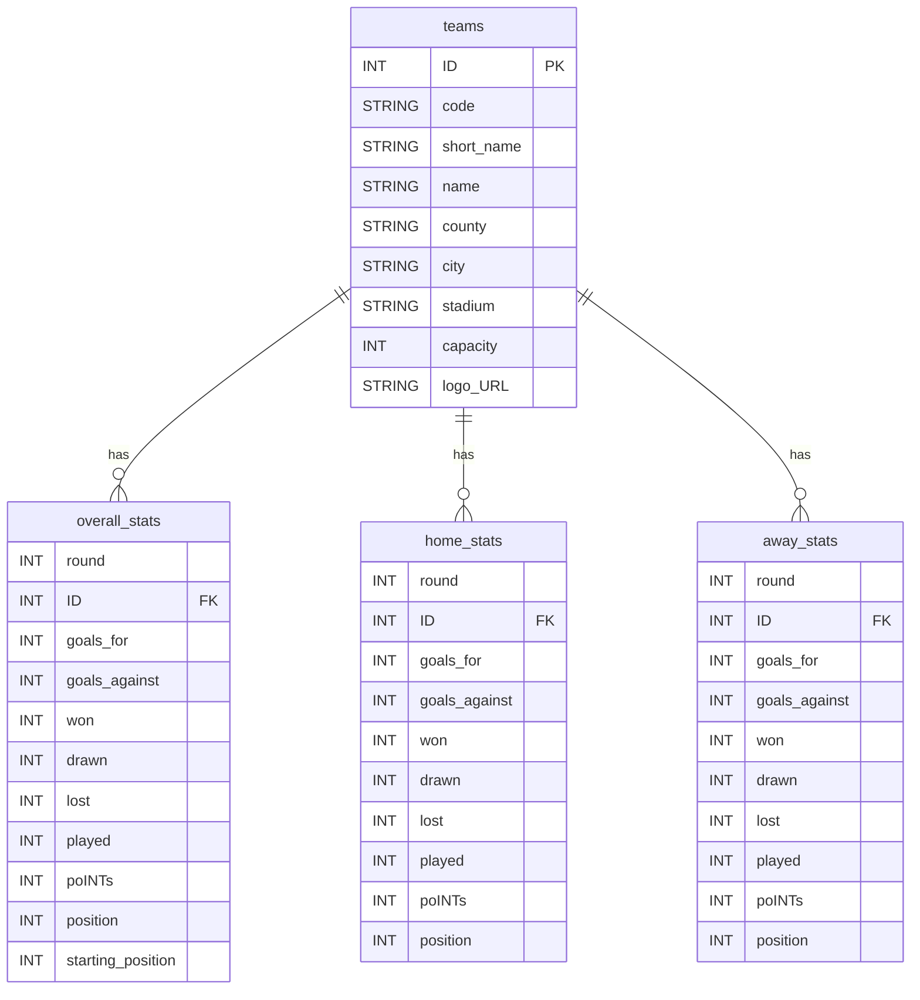

# premier-league-table
2024/25 Premier League Table

<div class="tableauPlaceholder" id="viz1771463932994" style="position: relative">
  <noscript>
    <a href="#">
      
    </a>
  </noscript>

  <object class="tableauViz" style="display:none;">
    <param name="host_url" value="https%3A%2F%2Fpublic.tableau.com%2F" />
    <param name="embed_code_version" value="3" />
    <param name="site_root" value="" />
    <param name="name" value="premier-league-table/Dashboard" />
    <param name="tabs" value="no" />
    <param name="toolbar" value="yes" />
    <param name="static_image" value="https://public.tableau.com/static/images/pr/premier-league-table/Dashboard/1.png" />
    <param name="animate_transition" value="yes" />
    <param name="display_static_image" value="yes" />
    <param name="display_spinner" value="yes" />
    <param name="display_overlay" value="yes" />
    <param name="display_count" value="yes" />
    <param name="language" value="en-US" />
  </object>
</div>

<script type="text/javascript">
  var divElement = document.getElementById('viz1771463932994');
  var vizElement = divElement.getElementsByTagName('object')[0];

  // 화면 크기에 따른 대시보드 사이즈 조절 로직
  if (divElement.offsetWidth > 800) {
    vizElement.style.width = '1024px';
    vizElement.style.height = '795px';
  } else if (divElement.offsetWidth > 500) {
    vizElement.style.width = '1024px';
    vizElement.style.height = '795px';
  } else {
    vizElement.style.width = '100%';
    vizElement.style.height = '1827px';
  }

  // Tableau API 스크립트 로드 및 삽입
  var scriptElement = document.createElement('script');
  scriptElement.src = 'https://public.tableau.com/javascripts/api/viz_v1.js';
  vizElement.parentNode.insertBefore(scriptElement, vizElement);
</script>


## 설치

```shell
c:\GitHub\premier-league-table\.venv\Scripts\python.exe -m pip install requests
c:\GitHub\premier-league-table\.venv\Scripts\python.exe -m pip install pandas
c:\GitHub\premier-league-table\.venv\Scripts\python.exe -m pip install rich
c:\GitHub\premier-league-table\.venv\Scripts\python.exe -m pip install openpyxl
```

## 데이터 구조 (ERD)

