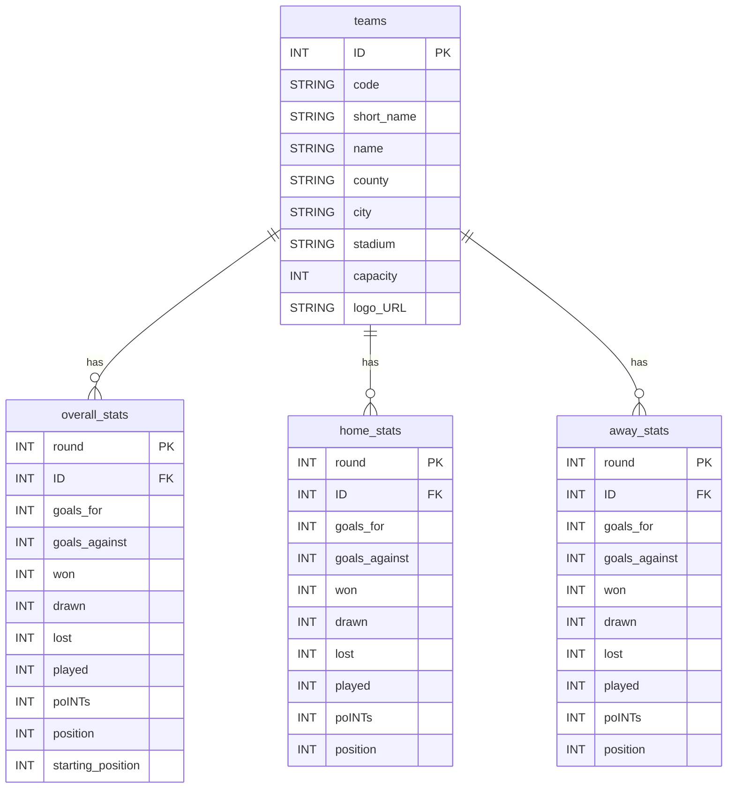

# EPL 팀별 모멘텀 분석 대시보드

<p align="center">
  <strong>2024/25 Premier League 시계열 데이터 수집 및 시각화 프로젝트</strong>
</p>

---

## 📊 프로젝트 개요

프리미어리그 공식 API에서 팀 정보와 전체 라운드(1-38) 순위표 데이터를 자동으로 수집하여, 팀별 성적 추이를 시계열로 분석할 수 있는 데이터 파이프라인 및 대시보드 프로젝트입니다.

---

## 🎯 문제 정의

기존 축구 데이터 서비스는 **경기 결과 위주의 단편적 정보**만 제공하여, 다음과 같은 한계가 있습니다:

- 팀의 장기적 흐름을 한눈에 파악하기 어려움
- 순위 변동의 맥락과 원인을 이해하기 어려움
- 홈/원정 성적 차이를 시계열로 비교하기 어려움
- 특정 구간에서의 팀 상태(상승세/하락세)를 정량적으로 판단하기 어려움

---

## ✅ 해결 전략

### 1. 시계열 데이터 재구성
- 모든 라운드(1-38)의 데이터를 **시계열로 재구성**하여 팀별 순위 추이를 직관적으로 확인
- Overall, Home, Away 통계를 분리하여 경기 장소별 성적 패턴 분석 가능

### 2. 자동화된 데이터 수집
- 프리미어리그 공식 API를 활용한 실시간 데이터 수집
- Rate Limit 및 에러 처리를 포함한 안정적인 재시도 로직 구현

### 3. 구조화된 데이터 저장
- 4개 테이블(teams, overall_stats, home_stats, away_stats)로 정규화
- 엑셀 형식으로 저장하여 Tableau 등 BI 도구와의 연계 용이

---

## 🚀 주요 기능

### 데이터 수집 기능
- ✅ **팀 정보 수집**: 20개 EPL 팀의 기본 정보, 경기장 정보, 로고 URL
- ✅ **순위표 수집**: 전체 38라운드의 팀별 순위 및 통계 (Overall/Home/Away)
- ✅ **중복 제거**: 경기가 없는 라운드의 중복 데이터 자동 필터링
- ✅ **에러 핸들링**: Rate Limit, Network Error 등 예외 상황 대응

### 데이터 처리 기능
- ✅ **타입 안정성**: TypedDict 기반 타입 정의로 데이터 구조 명확화
- ✅ **데이터 검증**: 팀별 played 값 추적으로 실제 경기 진행 여부 판단
- ✅ **정렬 및 정제**: 라운드/순위 기준 자동 정렬

---

## 🛠️ 기술 스택

### Core
- **Python 3.11+**: 메인 언어
- **Requests**: HTTP API 통신
- **Pandas**: 데이터 처리 및 엑셀 저장
- **Rich**: CLI 진행 상황 시각화

### Data Source
- **Premier League Official API**: 실시간 데이터 수집

### Visualization
- **Tableau Public**: 대시보드 시각화

---

## 📊 대시보드 미리보기

<div class="tableauPlaceholder" id="viz1771466650559" style="position: relative">
  <noscript>
    <a href="#">
      
    </a>
  </noscript>

  <object class="tableauViz" style="display:none;">
    <param name="host_url" value="https%3A%2F%2Fpublic.tableau.com%2F" />
    <param name="embed_code_version" value="3" />
    <param name="site_root" value="" />
    <param name="name" value="premier-league-table/Dashboard" />
    <param name="tabs" value="no" />
    <param name="toolbar" value="yes" />
    <param name="static_image" value="https://public.tableau.com/static/images/pr/premier-league-table/Dashboard/1.png" />
    <param name="animate_transition" value="yes" />
    <param name="display_static_image" value="yes" />
    <param name="display_spinner" value="yes" />
    <param name="display_overlay" value="yes" />
    <param name="display_count" value="yes" />
    <param name="language" value="ko-KR" /> <param name="filter" value="publish=yes" /> </object>
</div>

---

## 📦 설치 및 실행

### 1. 저장소 클론

```bash
git clone https://github.com/yourusername/premier-league-table.git
cd premier-league-table
```

### 2. 가상환경 생성 및 활성화

```bash
# Windows
python -m venv .venv
.venv\Scripts\activate

# macOS/Linux
python3 -m venv .venv
source .venv/bin/activate
```

### 3. 의존성 설치

```bash
pip install requests pandas rich openpyxl
```

또는 requirements.txt가 있는 경우:

```bash
pip install -r requirements.txt
```

### 4. 스크립트 실행

```bash
python src/main.py
```

### 5. 출력 결과

실행이 완료되면 `data/premier_league_table_2024-25.xlsx` 파일이 생성됩니다.

```
═══ Premier League Data Collection (2024/25) ═══

Step 1: 팀 데이터 수집 중...
✓ 완료: 20개 팀 정보 수집

Step 2: 순위표 데이터 수집 중 (1-38 라운드)...
         진행 ━━━━━━━━━━━━━━━━━━━━━━━━━━ 100%
✓ 완료: 38개 라운드 데이터 수집

Step 3: 엑셀 파일로 저장 중...
✓ 저장 완료: data/premier_league_table_2024-25.xlsx
  • teams: 20개 레코드
  • overall_stats: 760개 레코드
  • home_stats: 380개 레코드
  • away_stats: 380개 레코드

═══ 모든 작업 완료! ═══
```

---

## 📁 프로젝트 구조

```
premier-league-table/
├── src/
│   └── main.py              # 메인 데이터 수집 스크립트
├── data/
│   └── premier_league_table_2024-25.xlsx  # 수집된 데이터 (자동 생성)
├── .venv/                   # 가상환경 (git 제외)
├── .gitignore
├── README.md
└── requirements.txt         # (선택) 의존성 목록
```

---

## 📐 데이터 구조 (ERD)



### 테이블 설명

#### `teams` (팀 기본 정보)
- 20개 EPL 팀의 고유 정보, 경기장 정보, 로고 URL 포함
- `ID`를 기준으로 통계 테이블과 조인

#### `overall_stats` (전체 통계)
- 각 라운드별 팀의 전체 성적 (홈+원정 통합)
- `starting_position`: 해당 라운드 시작 전 순위 (추이 분석용)

#### `home_stats` (홈 통계)
- 홈 경기를 진행한 라운드에만 데이터 존재
- 팀별 홈 성적 패턴 분석에 활용

#### `away_stats` (원정 통계)
- 원정 경기를 진행한 라운드에만 데이터 존재
- 팀별 원정 성적 패턴 분석에 활용

---

## 🎯 성과 지표

### 데이터 분석 품질
- ✅ **시계열 완전성**: 전체 38라운드의 빠짐없는 데이터 수집
- ✅ **중복 제거**: 경기가 없는 라운드의 중복 레코드 자동 필터링
- ✅ **데이터 정합성**: Home + Away 통계 합계 = Overall 통계 검증 가능

### 분석 인사이트
- ✅ **흐름 중심 분석**: 단순 결과 나열을 넘어, 팀의 반등/하락 시점 예측 가능
- ✅ **홈/원정 패턴**: 경기 장소별 성적 차이 시각화로 전략적 인사이트 도출
- ✅ **모멘텀 추적**: 연속 승리/패배 구간 식별로 팀 컨디션 파악

---

## 🎨 Tableau 대시보드

수집된 데이터를 기반으로 제작된 인터랙티브 대시보드입니다.

### 주요 시각화
- **순위 추이 차트**: 시즌 전체 라운드에 걸친 팀별 순위 변화
- **득점/실점 트렌드**: 공격력과 수비력의 시계열 변화
- **홈/원정 성적 비교**: 경기 장소별 성적 차이 분석
- **모멘텀 지표**: 최근 N 라운드 승점 추이

> **대시보드 링크**: [Tableau Public에서 보기](https://public.tableau.com/views/premier-league-table/Dashboard)

---

## 🔧 주요 코드 구조

### 타입 정의 (TypedDict)
```python
class TeamData(TypedDict):
    """팀 정보 데이터 구조"""
    ID: int
    code: str
    short_name: str
    name: str
    # ...

class StatsData(TypedDict, total=False):
    """통계 데이터 구조"""
    round: int
    ID: int
    goals_for: int
    goals_against: int
    # ...
```

### 핵심 함수
- `fetch_with_retry()`: Rate Limit 대응 HTTP 요청
- `extract_teams_data()`: 팀 정보 추출
- `extract_standings_data()`: 순위표 데이터 추출 및 중복 제거
- `save_to_excel()`: 4개 테이블을 엑셀로 저장

---

## 📝 라이선스

This project is licensed under the MIT License.

---

## 👨‍💻 개발자

- **GitHub**: [@jaebinary](https://github.com/jaebinary)
- **Tableau Public**: [프로필 링크](https://public.tableau.com/app/profile/jaebinary)

---

## 📚 참고 자료

- [Premier League Official](https://www.premierleague.com)
- [Tableau Public Gallery](https://public.tableau.com/gallery)
- [Pandas Documentation](https://pandas.pydata.org/docs/)
