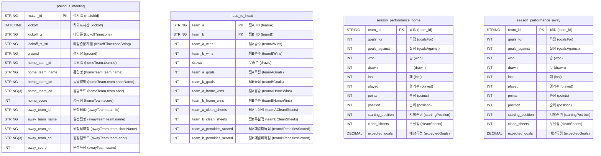

# API 엔드포인트

### [teams](\teams.json)
Request URL: https://sdp-prem-prod.premier-league-prod.pulselive.com/api/v1/competitions/8/seasons/2024/teams?_limit=20

---

### [standings](\standings.json)
Request URL: https://sdp-prem-prod.premier-league-prod.pulselive.com/api/v5/competitions/8/seasons/2025/matchweeks/1/standings

---

### [matches1](\matches1.json)
Request URL: https://sdp-prem-prod.premier-league-prod.pulselive.com/api/v1/competitions/8/seasons/2025/matchweeks/25/matches

---

### [matches2](\matches2.json)
Request URL: https://sdp-prem-prod.premier-league-prod.pulselive.com/api/v2/matches?competition=8&season=2025&matchweek=25

---

### [momentum](\momentum.json)
Request URL: https://sdp-prem-prod.premier-league-prod.pulselive.com/api/v1/matches/2562085/momentum

---

### [stats](\stats.json)
Request URL: https://sdp-prem-prod.premier-league-prod.pulselive.com/api/v3/matches/2562085/stats

```mermaid
erDiagram
    team_match_stats {
        STRING team_id PK "팀ID (teamId)"
        STRING side "홈원정 (side)"
    }

    goal_stats {
        STRING team_id FK "팀ID"
        INT goals "득점 (goals)"
        INT goals_conceded "실점 (goalsConceded)"
        INT goals_openplay "오픈플레이득점 (goalsOpenplay)"
        INT goals_conceded_ibox "박스내실점 (goalsConcededIbox)"
        INT goals_conceded_obox "박스밖실점 (goalsConcededObox)"
        DECIMAL expected_goals "예상득점 (expectedGoals)"
        DECIMAL expected_goals_on_target "예상타겟득점 (expectedGoalsOnTarget)"
        DECIMAL expected_goals_on_target_conceded "예상타겟실점 (expectedGoalsOnTargetConceded)"
        INT goal_assist "어시스트 (goalAssist)"
        INT goal_assist_openplay "오픈플레이어시스트 (goalAssistOpenplay)"
        INT goal_assist_setplay "세트피스어시스트 (goalAssistSetplay)"
        DECIMAL expected_assists "예상어시스트 (expectedAssists)"
    }

    shot_stats {
        STRING team_id FK "팀ID"
        INT total_scoring_att "총슛 (totalScoringAtt)"
        INT ontarget_scoring_att "유효슛 (ontargetScoringAtt)"
        INT shot_off_target "슛오프타겟 (shotOffTarget)"
        INT big_chance_scored "빅찬스득점 (bigChanceScored)"
        INT big_chance_created "빅찬스생성 (bigChanceCreated)"
        INT attempts_ibox "박스내슛 (attemptsIbox)"
        INT attempts_obox "박스밖슛 (attemptsObox)"
        INT blocked_scoring_att "차단된슛 (blockedScoringAtt)"
        INT shot_fastbreak "역습슛 (shotFastbreak)"
    }

    pass_stats {
        STRING team_id FK "팀ID"
        INT total_pass "총패스 (totalPass)"
        INT accurate_pass "정확한패스 (accuratePass)"
        INT open_play_pass "오픈플레이패스 (openPlayPass)"
        INT successful_open_play_pass "성공한오픈플레이패스 (successfulOpenPlayPass)"
        INT fwd_pass "전진패스 (fwdPass)"
        INT backward_pass "후진패스 (backwardPass)"
        INT total_long_balls "총롱볼 (totalLongBalls)"
        INT accurate_long_balls "정확한롱볼 (accurateLongBalls)"
        INT total_cross "총크로스 (totalCross)"
        INT accurate_cross "정확한크로스 (accurateCross)"
        INT total_through_ball "총스루패스 (totalThroughBall)"
        INT accurate_through_ball "정확한스루패스 (accurateThroughBall)"
    }

    possession_stats {
        STRING team_id FK "팀ID"
        INT possession_percentage "점유율 (possessionPercentage)"
        INT touches "터치수 (touches)"
        INT touches_in_opp_box "상대박스터치 (touchesInOppBox)"
        INT ball_recovery "볼회수 (ballRecovery)"
        INT poss_lost_all "볼소유상실 (possLostAll)"
        INT poss_lost_ctrl "컨트롤상실 (possLostCtrl)"
        INT dispossessed "탈취당함 (dispossessed)"
    }

    defensive_stats {
        STRING team_id FK "팀ID"
        INT total_tackle "총태클 (totalTackle)"
        INT won_tackle "성공태클 (wonTackle)"
        INT interception "인터셉트 (interception)"
        INT interception_won "성공인터셉트 (interceptionWon)"
        INT total_clearance "총클리어런스 (totalClearance)"
        INT effective_clearance "유효클리어런스 (effectiveClearance)"
        INT head_clearance "헤드클리어런스 (headClearance)"
        INT outfielder_block "필드차단 (outfielderBlock)"
        INT blocked_cross "차단크로스 (blockedCross)"
    }

    duel_stats {
        STRING team_id FK "팀ID"
        INT duel_won "듀얼승 (duelWon)"
        INT duel_lost "듀얼패 (duelLost)"
        INT aerial_won "공중볼승 (aerialWon)"
        INT aerial_lost "공중볼패 (aerialLost)"
        INT won_contest "컨테스트승 (wonContest)"
        INT total_contest "총컨테스트 (totalContest)"
        INT challenge_lost "챌린지패 (challengeLost)"
    }

    card_stats {
        STRING team_id FK "팀ID"
        INT yellow_card "옐로카드 (yellowCard)"
        INT red_card "레드카드 (redCard)"
        INT total_yel_card "총옐로카드 (totalYelCard)"
        INT total_red_card "총레드카드 (totalRedCard)"
    }

    goalkeeper_stats {
        STRING team_id FK "팀ID"
        INT saves "선방 (saves)"
        INT saved_ibox "박스내선방 (savedIbox)"
        INT saved_obox "박스밖선방 (savedObox)"
        INT diving_save "다이빙선방 (divingSave)"
        INT good_high_claim "공중볼잡기 (goodHighClaim)"
        INT punches "펀칭 (punches)"
        INT keeper_throws "킥스로우 (keeperThrows)"
        INT accurate_keeper_throws "정확한스로우 (accurateKeeperThrows)"
    }

    other_stats {
        STRING team_id FK "팀ID"
        INT corner_taken "코너킥 (cornerTaken)"
        INT won_corners "획득코너 (wonCorners)"
        INT lost_corners "상실코너 (lostCorners)"
        INT total_offside "오프사이드 (totalOffside)"
        INT fk_foul_won "파울획득 (fkFoulWon)"
        INT fk_foul_lost "파울범함 (fkFoulLost)"
        DECIMAL total_distance "총이동거리 (totalDistance)"
        JSON fastest_player "최고속도선수 (fastestPlayer)"
        INT subs_made "교체수 (subsMade)"
        INT error_lead_to_goal "실책실점 (errorLeadToGoal)"
        INT error_lead_to_shot "실책슛허용 (errorLeadToShot)"
    }

    team_match_stats ||--|| goal_stats : "has"
    team_match_stats ||--|| shot_stats : "has"
    team_match_stats ||--|| pass_stats : "has"
    team_match_stats ||--|| possession_stats : "has"
    team_match_stats ||--|| defensive_stats : "has"
    team_match_stats ||--|| duel_stats : "has"
    team_match_stats ||--|| card_stats : "has"
    team_match_stats ||--|| goalkeeper_stats : "has"
    team_match_stats ||--|| other_stats : "has"
```

---

### [preview](\preview.json)
Request URL: https://sdp-prem-prod.premier-league-prod.pulselive.com/api/v2/matches/2562085/preview

---

### [lineups](\lineups.json)
Request URL: https://sdp-prem-prod.premier-league-prod.pulselive.com/api/v3/matches/2562085/lineups

---

### [commentary](\commentary.json)
Request URL: https://sdp-prem-prod.premier-league-prod.pulselive.com/api/v1/matches/2562085/commentary?_limit=100

